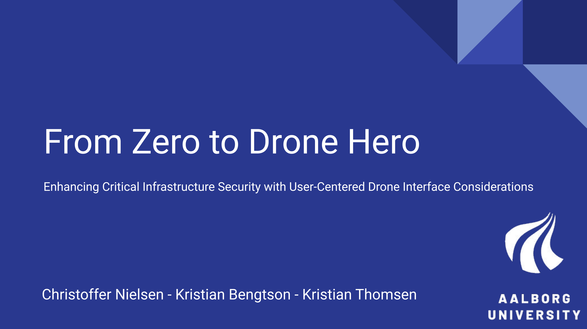
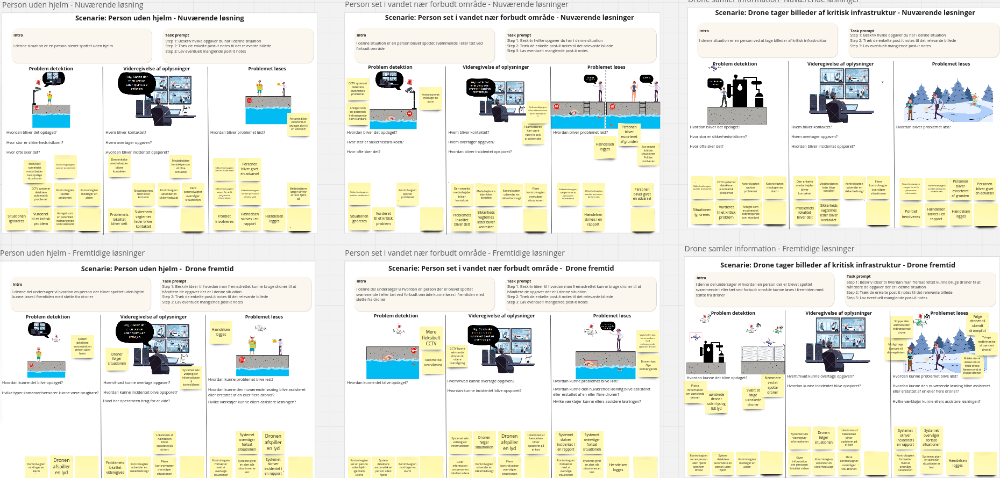
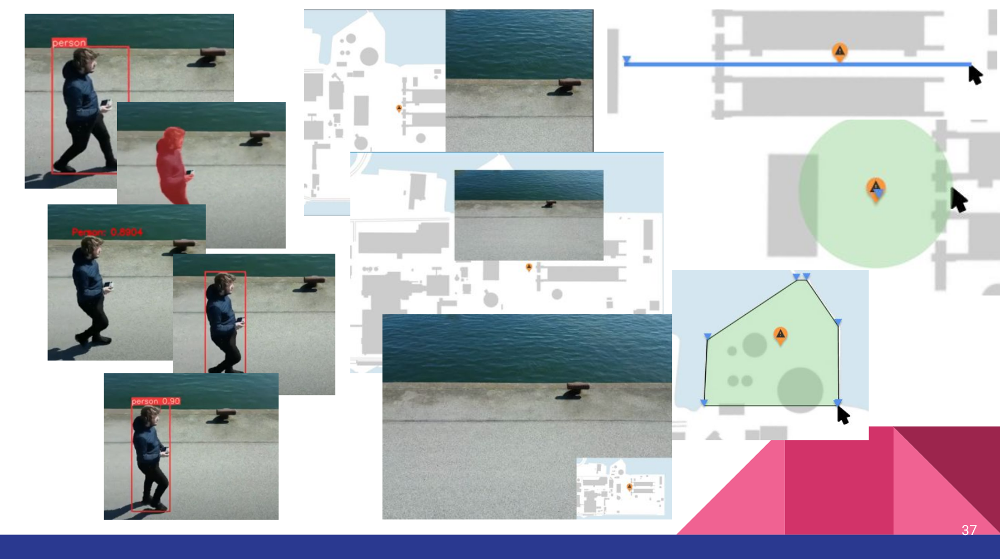
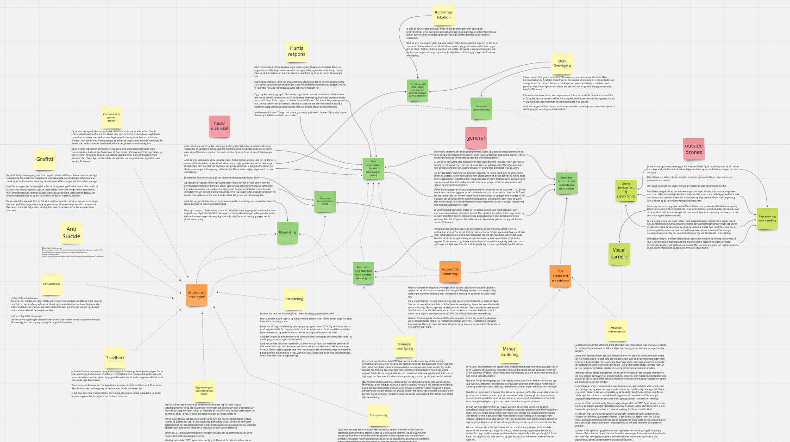

<h1 align="center">Master's degree thesis and presentation</h1>
<h3 align="center">A tale of seagulls, pirates and russian spies!</h3>

I wrote my thesis at Aalborg University together with two other students. We studied in the field of Human-Computer Interaction and was guided by [Timothy Robert Merritt](https://vbn.aau.dk/en/persons/merritt). The project was in relation to a larger project called [HERD](https://herdproject.dk/) which research focus is to utilize drones and drone swarms to enhance processes in fields such as society, agriculture and search and rescue.

## P9
In the preliminary semester we worked with [Robotto](https://www.robotto.ai/), an AI and drone company, and *Amagerværket*, a biofuel power plant. We engaged in a number of codesign session to explore how biofuel volumetrics should be displayed to the user and which other uses drones could serve in critical infrastructure.

## P10
In our final semester we investigated the security and safety of critical infrastructure. Threats are becoming more sophisticated while traditional monitoring methods are becoming insufficient. Drones are becoming more prevalent and have emerged as a promising answer to the security and surveillance needs, by offering capabilities in rapid response and monitoring.However there has not been a lot of research into what the user wants from a system utilizing drones for security and surveillance, and how those needs translate to designing a user interface for such a system. We investigate what operations personnel want from a system using drones, and how an interface should be designed to support those wants. The drones are tasked with monitoring for intruders, and responding to alarms. This paper has resulted in several design suggestions for designers to use, and researchers
to explore.

### 1st study visual aid

### 2nd study visual aid

### 1st study thematic analysis snapshot (inductive)
